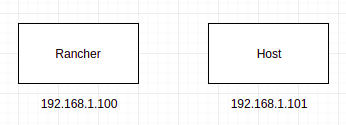
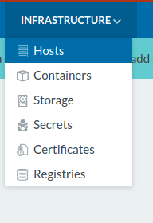
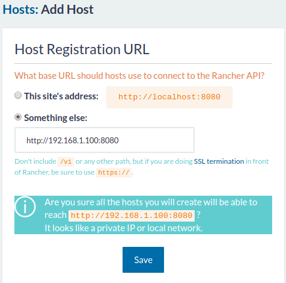
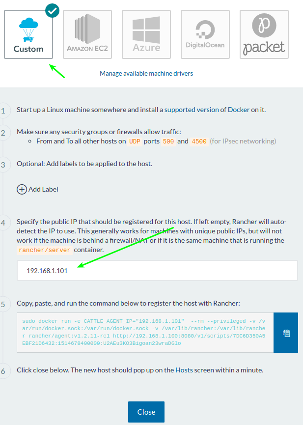
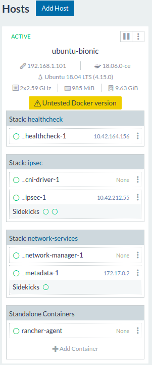

# Rancher vagrant

Script de Vagrant multimachine que crea dos nodos uno como servidor de Rancher 1.6.x y otro como Host de aplicaciones desplegadas desde Rancher.
## Máquinas

## Cargando el Ambiente
En el folder donde clono el proyecto digite el siguiente comando

    vagrant up

Esto iniciará las dos máquinas virutales.

## Accediendo a RANCHER

En el navegador vaya a: http://127.0.0.1:8080

## Registrando el Host

En el menú de rancher ir a Infrastructure>host y de clic en el boton **Add Host**
   >> 

Dado que es el primer host a adicionar, nos preguntará por la IP de Rancher configurela con la ip que se asignó a la máquina virtual como se muestra en la imagen.

Utilizando el Orquestador de Cattle confgure las etiquetas y la IP del host a adicionar.

Copie la URL e ingrese al segundo host usando el siguiente comando

    vagrant ssh rancher_node

Pegue este comando y revise en Rancher, ahora debería existir un nuevo nodo.

## Requerimientos
2Gb de RAM Libres
[Virtualbox]()
[Vagrant]()
